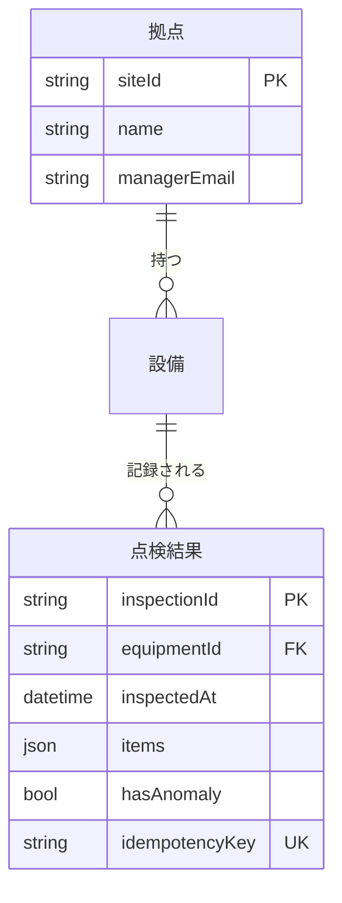

# CTR-F-003：点検DB

同一システム内だが、複数コンポーネント（点検API・管理API・異常通知）から使われるため ER 図を持つ。

```mermaid
erDiagram
  拠点 ||--o{ 設備 : 持つ
  設備 ||--o{ 点検結果 : 記録される
  拠点 {
    string siteId PK
    string name
    string managerEmail
  }
  点検結果 {
    string inspectionId PK
    string equipmentId FK
    datetime inspectedAt
    json items
    bool hasAnomaly
    string idempotencyKey UK
  }
```

注：「設備」テーブルは開発オブジェクトとしてまだ起こしていない（サンプルで発見した抜け）。
